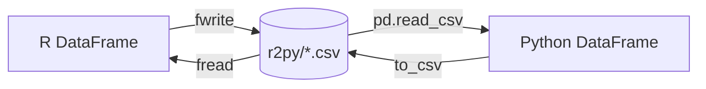

# OpenClaw + JupyterLab + RStudio

> Python & R 双语 AI 数据分析环境 —— Fast-Python-AI，平替 Posit AI

一体化的 **Python + R** 数据分析工作台，以 **OpenClaw AI Agent** 为大脑，串联 **JupyterLab (Python)** 和 **RStudio (R)** 两个交互式分析引擎，实现跨语言数据流无缝流转。

## 为什么做这个

在数据科学/统计分析领域，Python 和 R 各有不可替代的生态。传统方案（如 Posit/Quarto）侧重 R 端整合，Python 端依赖 reticulate，体验割裂。这套方案用 **OpenClaw Agent 做胶水层** + **CSV 共享做数据交换**，让两个语言各取所长，在同一平台下顺畅协作。

### 核心优势

- 🏠 **数据不出服务器不出境**，内网可配合一体机部署
- 🇨🇳 **国内信创环境已验证**：麒麟 V10 + 鲲鹏 CPU (ARM64) + 国产满血版 LLM
- 🔄 **LLM 可按需切换**（DeepSeek / GLM / MiniMax / Kimi 等）
- 🪶 轻量级浏览器界面，易用易部署易维护
- 🔓 完全开源免费
- 📊 AI 贯穿 **编码阶段** + **数据分析阶段**

## 架构

```
┌─────────────────────────────────────────────────────────┐
│                  用户 (浏览器界面)                         │
└────────────────────────┬────────────────────────────────┘
                         │
              ┌──────────▼──────────┐
              │    OpenClaw Agent    │  ← AI 大脑，连接工具 + LLM
              │  (对话 / 指令路由)    │
              └──────┬────────┬──────┘
                     │        │
          ┌──────────▼─┐  ┌──▼──────────┐
          │ JupyterLab  │  │   RStudio   │
          │  (Python)   │  │    (R)      │
          │  MCP Server │  │  R API      │
          └──────┬──────┘  └──────┬──────┘
                 │                │
                 └───────┬────────┘
                         ▼
              ┌──────────────────┐
              │   r2py 共享目录    │  ← CSV 跨语言数据交换
              └──────────────────┘
```

| 组件 | 用途 |
|---|---|
| **OpenClaw** | AI 代理框架，对话式分析入口，LLM 路由 |
| **JupyterLab + MCP** | Python 交互式数据分析（pandas / matplotlib / sklearn 等） |
| **RStudio + R API** | R 语言统计分析（data.table / ggplot2 / tidyverse 等） |
| **r2py** | R ↔ Python 跨语言数据交换（CSV 共享目录） |

## 项目结构

```
openclaw_with_jupyterlab_and_rstudio/
├── jupyter_mcp/              # Jupyter MCP Server（Python 端连接桥）
│   ├── jupyter-mcp-server.py # MCP Server 实现
│   ├── hook.py               # Kernel 侧注册钩子
│   └── setup.py              # Python 包安装
├── r-session-ai/             # R Session API（R 端连接桥）
│   ├── r-session-api.R       # R API 服务（httpuv）
│   └── r-session-mcp-server.py # MCP Server 实现
├── labextensions/            # JupyterLab 自定义扩展
│   ├── jupyterlab-auto-reload/  # Notebook 自动刷新
│   └── jupyterlab-console-adopt/ # Console 回显
├── .gitignore
├── openclaw.json             # OpenClaw（工具 & MCP）配置
├── MEMORY.md                 # 项目记忆与操作记录
└── README.md                 # ← 你在这里
```

## 快速开始

### 前置要求

- Python 3.10+（建议 Conda 环境）
- R 4.x + RStudio Server
- Node.js 18+
- JupyterLab

### 安装

```bash
git clone https://github.com/icejean/openclaw_with_jupyterlab_and_rstudio.git
cd openclaw_with_jupyterlab_and_rstudio
```

各子目录下的 README 有详细部署说明：
- `jupyter_mcp/README.md` — Python 端 MCP 连接
- `r-session-ai/README.md` — R 端 API 连接

### 使用流程

1. 启动 JupyterLab 和 RStudio
2. 在 Jupyter kernel 中注册 MCP 钩子
3. 在 RStudio 中启动 R API
4. 通过 OpenClaw 对话式发号施令

### 数据交换（R ↔ Python）



R ↔ Python 通过 CSV 文件在 `r2py/` 共享目录交换数据。支持的类型映射：

| Python | R | 备注 |
|---|---|---|
| int64 | integer | |
| float64 | numeric | |
| object (str) | character | |
| bool | logical | |
| datetime64 | Date / POSIXct | 导入后需主动转换类型 |

## 场景示例

| 场景 | Python | R |
|---|---|---|
| 数据清洗、ETL | ✅ pandas | |
| 统计分析、回归建模 | | ✅ lm, glm |
| 可视化（交互式） | ✅ plotly | ✅ ggplot2 |
| 可视化（出版级） | | ✅ ggplot2 |
| 机器学习（传统） | ✅ sklearn | |
| 深度学习 | ✅ PyTorch / TensorFlow | |
| 时间序列分析 | | ✅ forecast |
| 报表生成 | ✅ nbconvert | ✅ rmarkdown |

## License

MIT

---

> *🐵 大圣出品 —— 让 Python 和 R 在 AI 驱动下高效协作*
