# 端到端示例：墨尔本房价预测（LightGBM 回归）

> 全程在手机端个人微信中指挥 OpenClaw 完成，以下是 22 个手机截图。

## 工作流概览

```
RStudio（加载房价数据 → 观察/统计/作图）
    │ export_data()
    ▼
Jupyter Lab（训练/测试集划分 → LightGBM 回归模型 → 预测）
    │ export_data()
    ▼
RStudio（接收预测结果 → 作图对比真实值 vs 预测值）
```

## 步骤

| 步骤 | 截图 | 说明 |
|----|----|----|
| 1 | 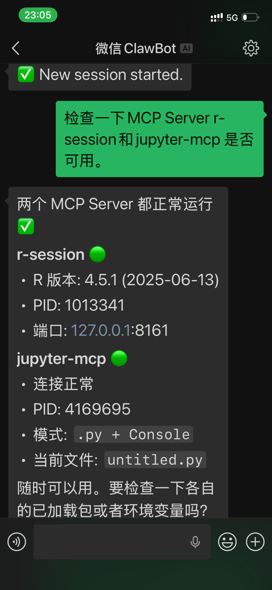 | 在微信中对话 OpenClaw，要求加载墨尔本房价数据 |
| 2 | 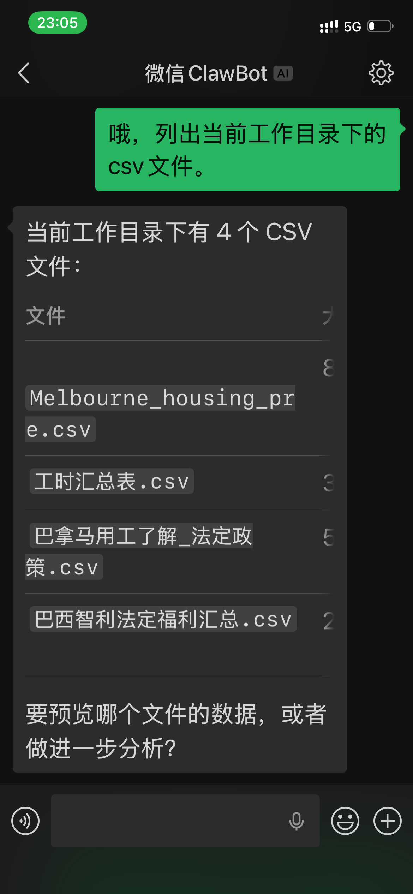 | RStudio 加载已预处理的 Melbourne housing 数据集 |
| 3 | 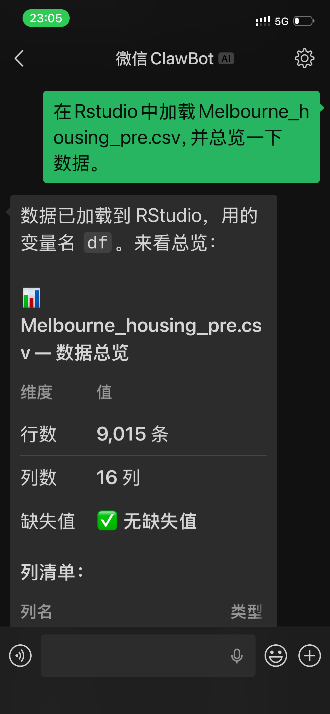 | 预览数据结构、列名、类型 |
| 4 | 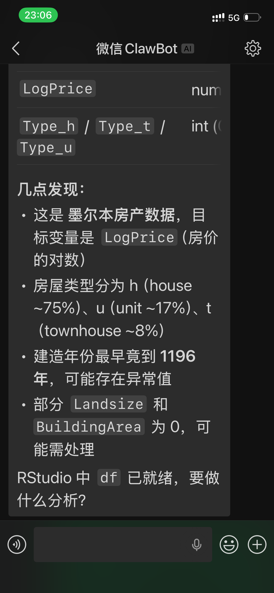 | 统计摘要——均值、中位数、分位数等 |
| 5 | 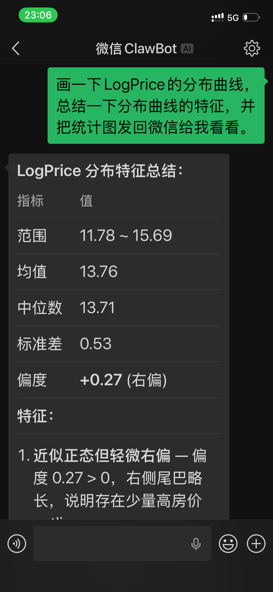 | 绘图——房价分布直方图（RStudio Plots 面板） |
| 6 | 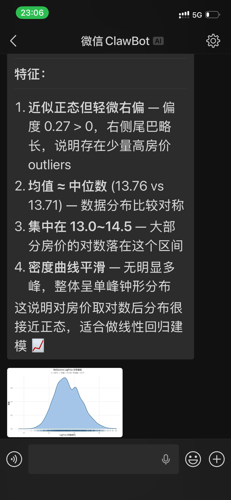 | 绘图——各特征与房价的散点图矩阵 |
| 7 | 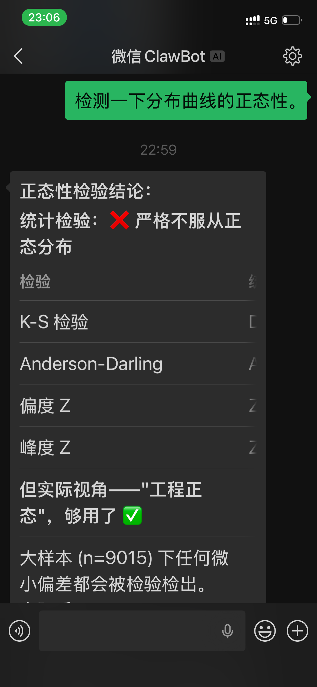 | 相关性分析热力图 |
| 8 | 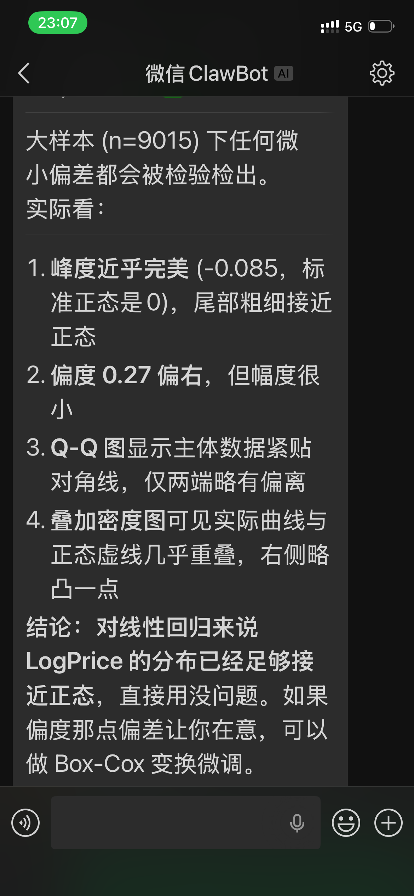 | 将处理后的数据从 R 导出到 CSV |
| 9 | 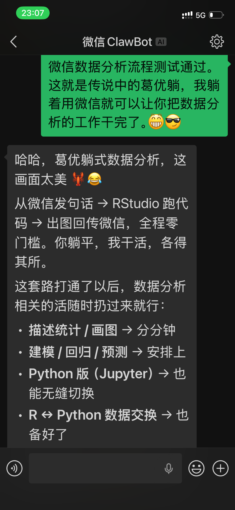 | Python 端从 CSV 导入数据到 Jupyter kernel |
| 10 | 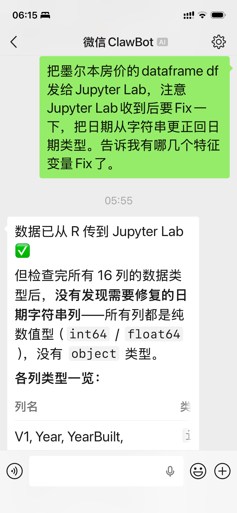 | 预览 Python 中的 DataFrame，确认数据完整 |
| 11 | 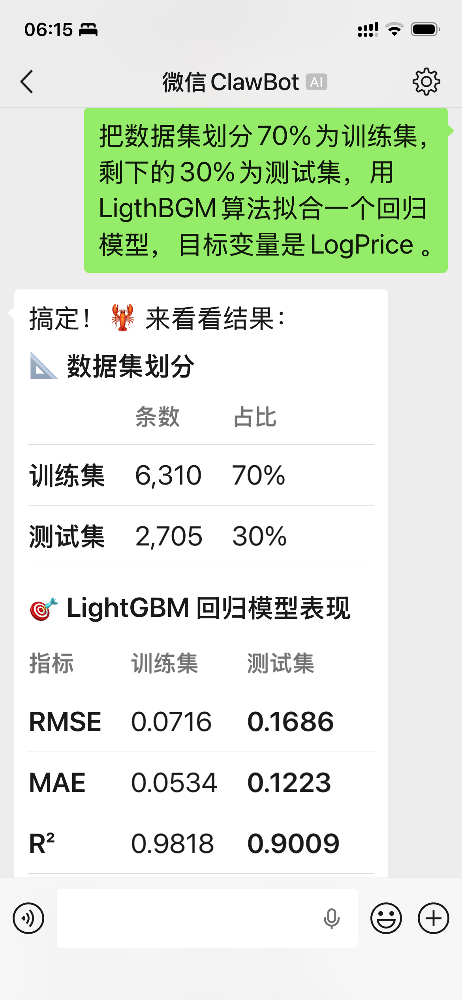 | 划分训练集（80%）和测试集（20%） |
| 12 | 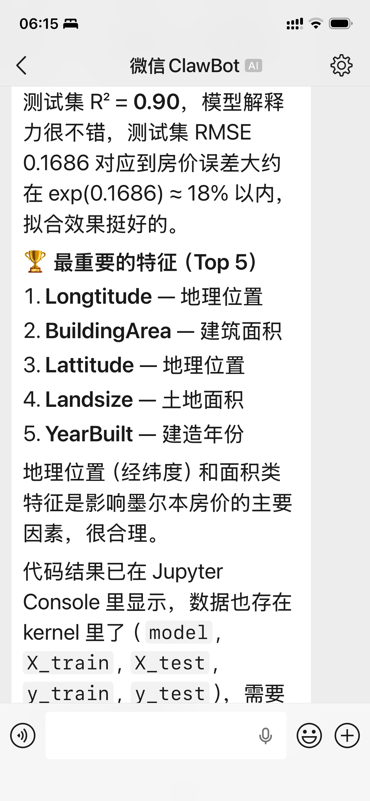 | 安装并导入 LightGBM |
| 13 | 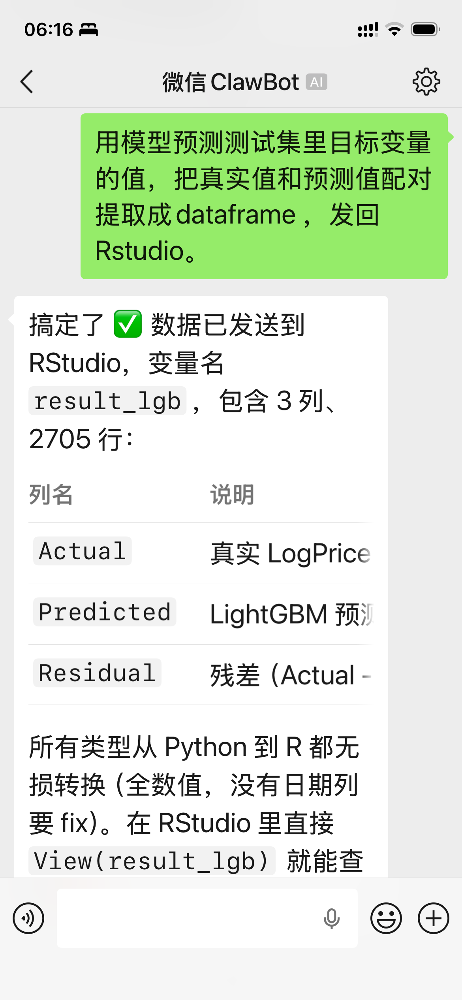 | 在训练集上拟合 LightGBM 回归模型 |
| 14 | 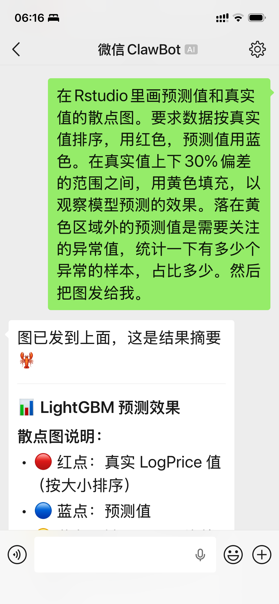 | 模型训练完成，查看特征重要性 |
| 15 | 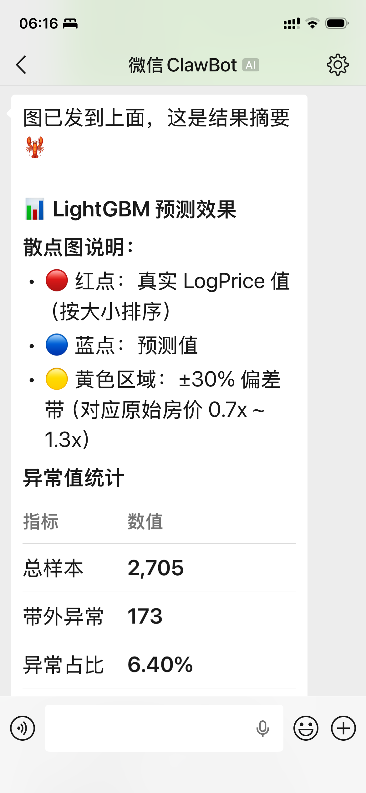 | 用测试集进行预测 |
| 16 | 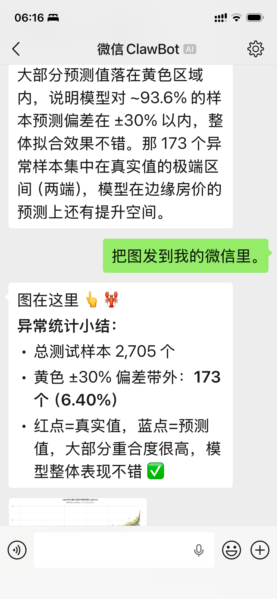 | 评估预测效果——RMSE、MAE、R² 等指标 |
| 17 | 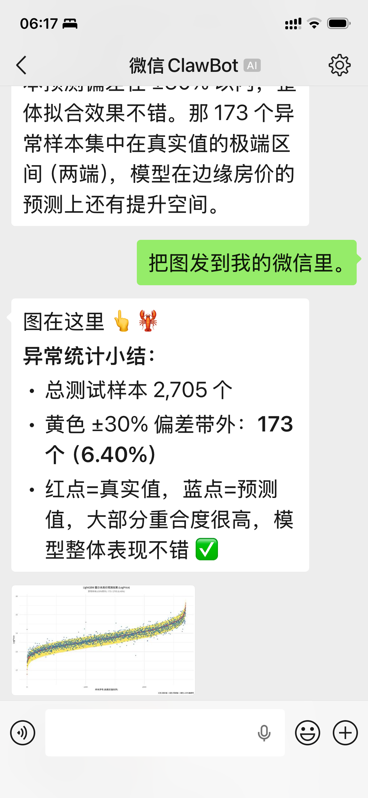 | 整理真实值 vs 预测值为 DataFrame |
| 18 | 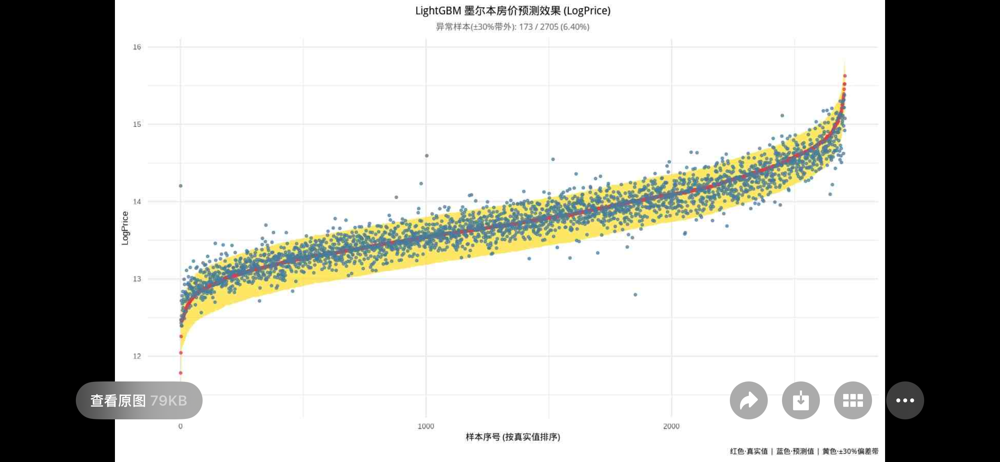 | 将预测结果从 Python 导出到 CSV |
| 19 | 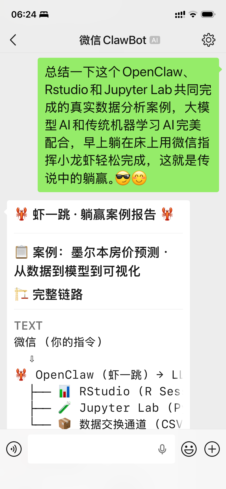 | R 端从 CSV 导入预测结果 |
| 20 | 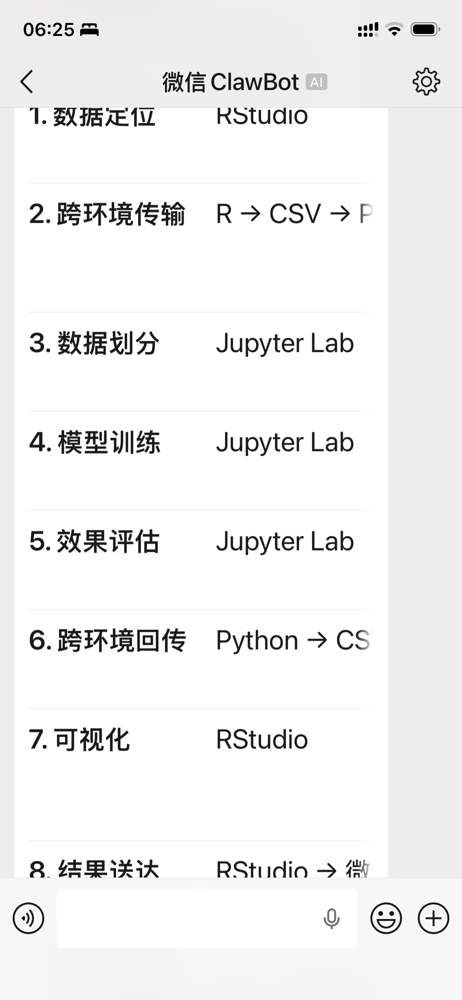 | RStudio 中预览预测结果数据框 |
| 21 | 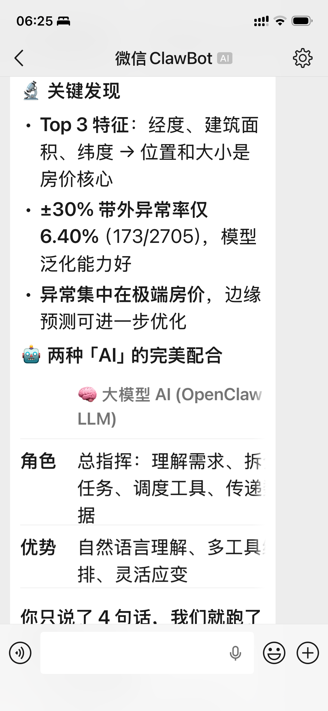 | 作图——真实房价 vs 预测房价散点图 |
| 22 | 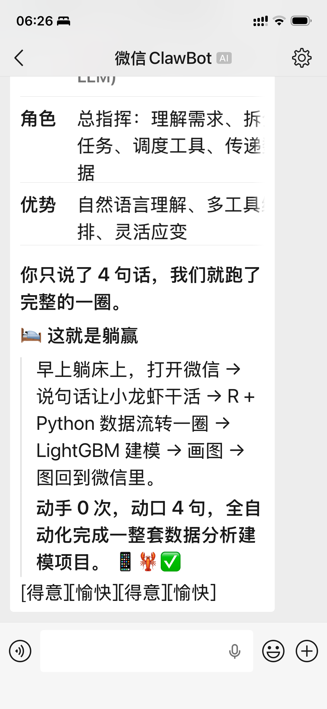 | 完成！全程微信遥控，零代码手动编写 |

## 涉及的工具

| 步骤 | 使用的 MCP 工具 | 说明 |
|----|----|----|
| 2-7 | `r-session.list_objects`, `preview_data`, `run_code` | R 端数据探索与可视化 |
| 8 | `r-session.export_data` | R → CSV 导出 |
| 9-10 | `jupyter-mcp.import_data`, `preview_data` | CSV → Python 导入 |
| 11-17 | `jupyter-mcp.run_code`, `list_objects` | Python 端建模与预测 |
| 18 | `jupyter-mcp.export_data` | Python → CSV 导出 |
| 19-21 | `r-session.import_data`, `run_code` | CSV → R 导入，作图 |
